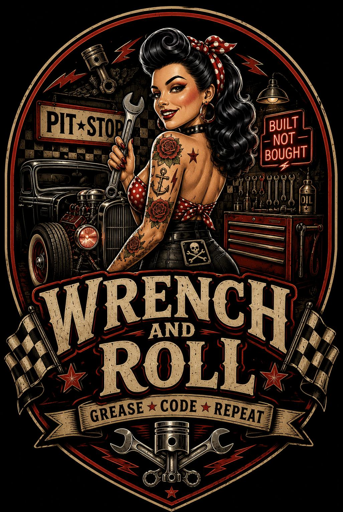

# WrenchAndRoll
Grease-monkey setup for total beginners. Get FreePascal (Geany/Lazarus) &amp; C/C++ builds rolling on Linux, Windows, and macOS. No diploma required—just grab your wrench and roll!





**WrenchAndRoll** — a greaser's toolkit for building my projects.  
Zero headaches. Single setup. Drop-in replacement for "I don't know how to compile this"  
without the confusion, without the dependency circus, without the RTFM.

**Dual toolchain:** Free Pascal and C/C++. Same spec. Two languages. Real builds.

---


---

## What is this?

Hey, code greaser! Don't know a compiler from a carburetor?  
This repo hot-rods your **Linux**, **Windows**, or **macOS** rig so you can build my FreePascal & C/C++ projects.  
Zero experience needed—just grab your wrench and roll!

---

## Toolchain by Platform

| OS | Free Pascal | C/C++ | IDE / Editor |
|---|---|---|---|
| **Linux** | `fpc` + `Geany` | `gcc`/`g++` + `Geany` | Geany |
| **Windows** | `Lazarus` + `fpc` | `gcc`/`g++` + `Geany` | Lazarus / Geany |
| **macOS** | `fpc` + `Geany` | `clang`/`clang++` + `Geany` | Geany |

---

## Quick Start

### Linux (Debian/Ubuntu)
```bash
sudo apt update
sudo apt install fpc geany gcc g++ make
# Clone any of my repos and build with Geany (Build → Compile)
